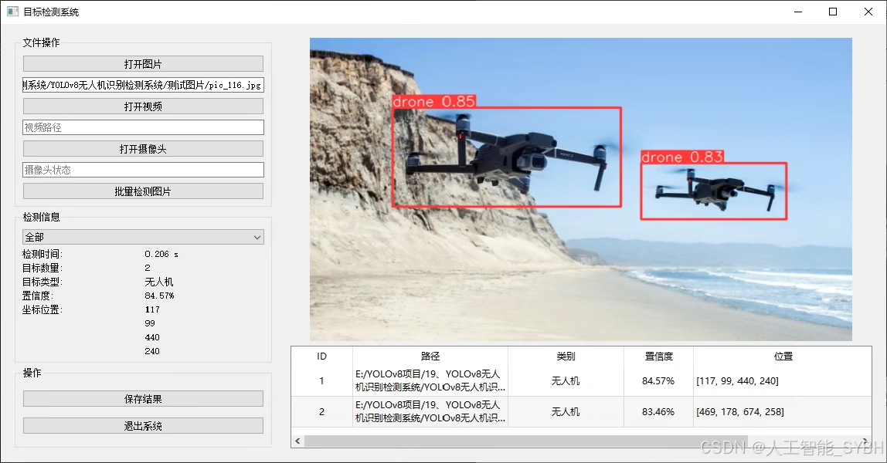
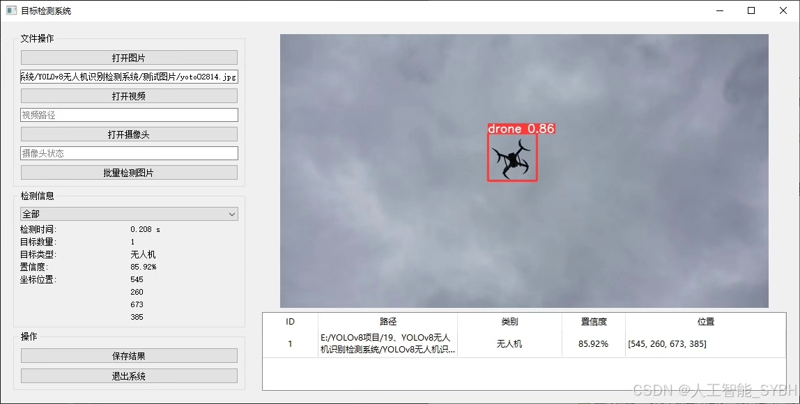
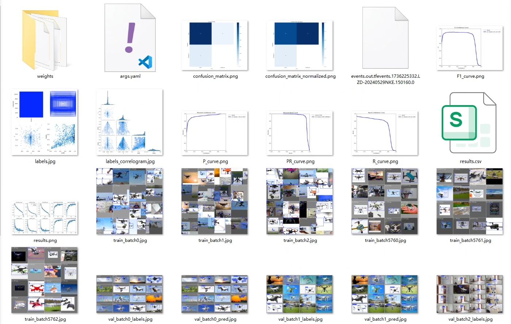
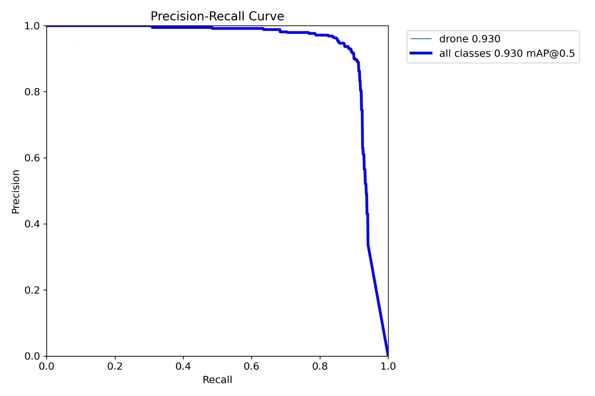
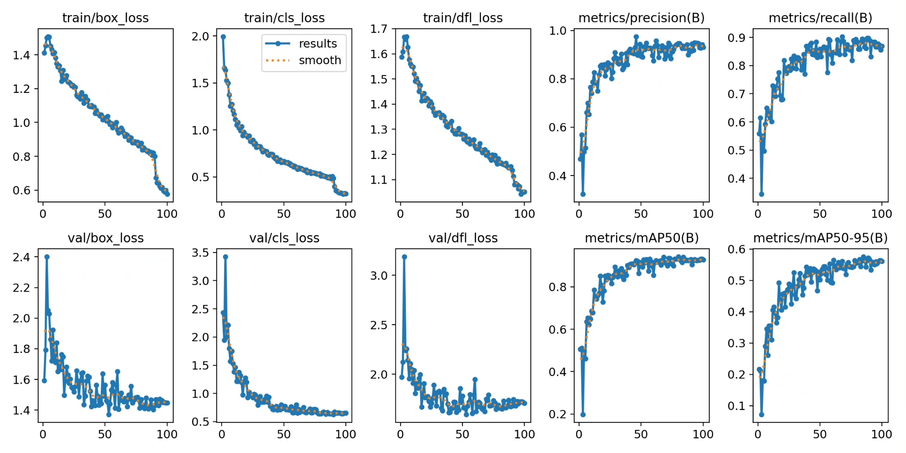
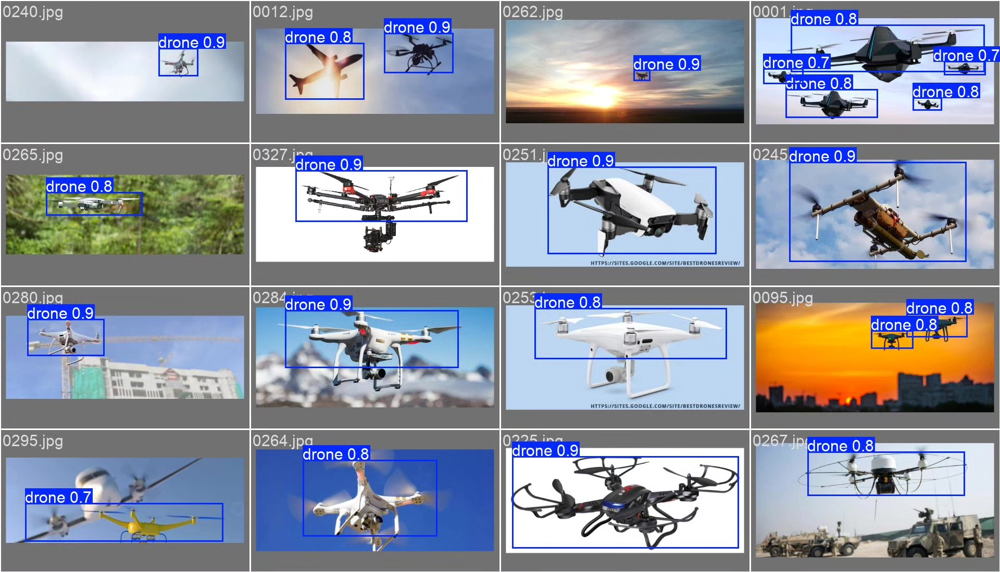
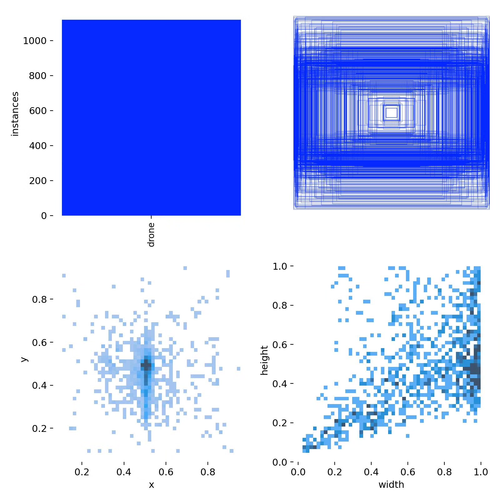
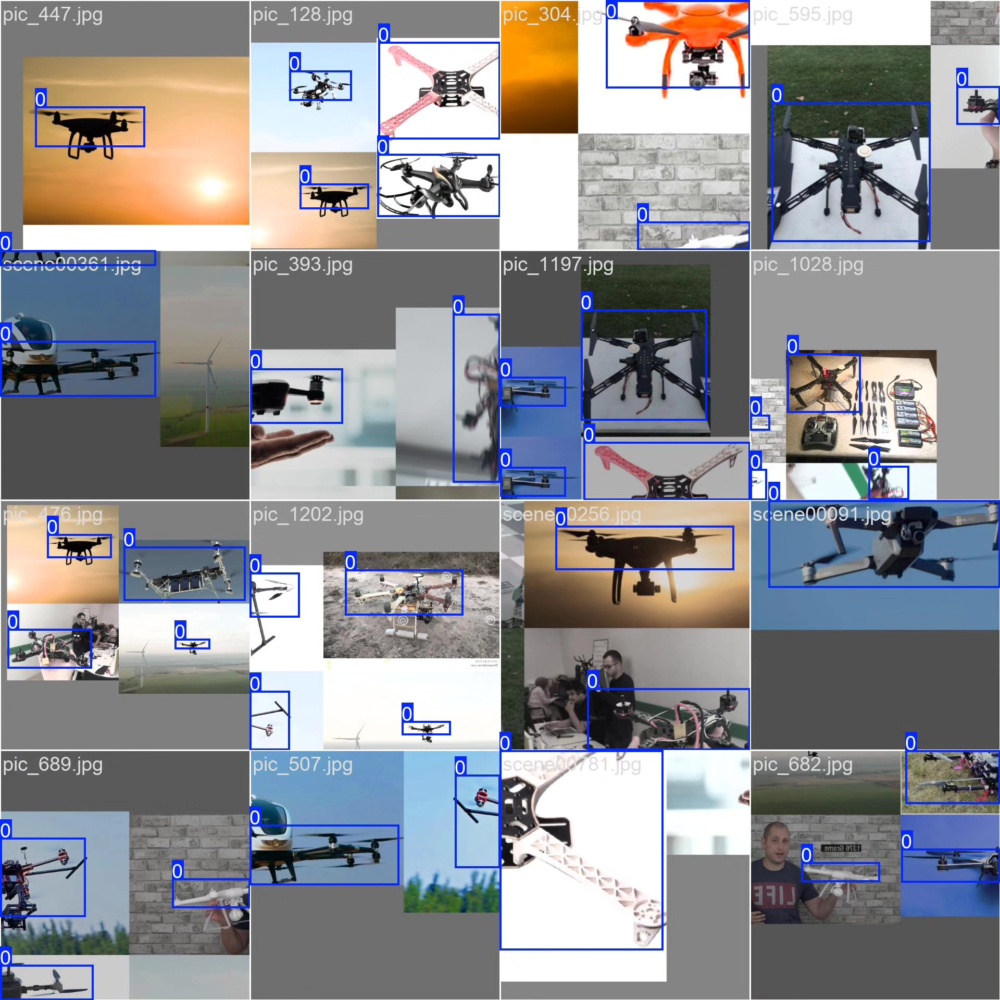

# UAV Recognition and Detection System Based on YOLOv8 Deep Learning (YOLOv8+)

## Body

This project is based on the YOLOv8 (You Only Look Once v8) object detection algorithm, developing a high-efficiency and precise drone recognition and detection system. It is specifically designed for real-time detection and positioning of drone targets. The system is optimized only for the single category (drone), ensuring high detection accuracy and real-time performance even in complex backgrounds. The dataset contains 1359 labeled images, including 1012 training images and 347 validation images, covering different lighting conditions, flight attitudes, and background interference scenarios to enhance the model's generalization ability.

The company's products have obtained the official commercial license certification from YOLO.

We provide after-sales service:

After payment, we will provide WeChat IDs for instant questions and answers.

Environmental configuration: We will provide an environmental configuration tutorial, and WeChat will provide Q&A services.

Remote installation service: If you need remote configuration, an additional fee of 69 is required, with all fees refunded if the configuration fails (only the installation fee is refunded for special old computers).

Retraining dataset: After setting up the environment, you can train on your own computer. If you need us to retrain, just pay 69 plus computing power fees (2.5 yuan/hour).

Full after-sales service

## Images

## Payment

Here is a pay link on Stripe ( https://buy.stripe.com/3cs8yP7sY87d0vu9AB ). Please contact me lonlonago@foxmail.com after funding $89, and I will send you a complete data files , thank you!

